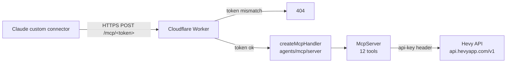

# hevy-mcp

A small, self-hosted [MCP](https://modelcontextprotocol.io) server on Cloudflare Workers that lets Claude read your [Hevy](https://hevy.com) training data and manage routines through a custom connector.

- Reads: workouts, workout events, routines, routine folders, exercise templates, exercise history
- Writes: routines only (create and update). Workouts are read-only in v1.
- No database, no Durable Objects, no OAuth. One Worker, two secrets.

## How it works



The Worker is stateless: every request builds a fresh `McpServer`, checks the path token in constant time, and proxies tool calls to Hevy with your API key. Anything that is not `/mcp/<token>` gets a 404, so the URL itself is the only credential a client needs.

## Tools

| Tool | Hevy endpoint | Notes |
| --- | --- | --- |
| `get_workouts` | `GET /workouts` | Max 10 per page |
| `get_workout` | `GET /workouts/{id}` | Full sets and exercises |
| `get_workout_count` | `GET /workouts/count` | |
| `get_workout_events` | `GET /workouts/events?since=` | Incremental sync of updates and deletes |
| `get_routines` | `GET /routines` | Max 10 per page |
| `get_routine` | `GET /routines/{id}` | |
| `get_routine_folders` | `GET /routine_folders` | Max 10 per page |
| `create_routine` | `POST /routines` | Write |
| `update_routine` | `PUT /routines/{id}` | Write, replaces the whole routine |
| `get_exercise_templates` | `GET /exercise_templates` | Max 100 per page |
| `get_exercise_template` | `GET /exercise_templates/{id}` | |
| `get_exercise_history` | `GET /exercise_history/{id}` | Optional `start_date` and `end_date` |

Routine write bodies follow the Hevy spec exactly. Set fields are `type` (`warmup`, `normal`, `failure`, `dropset`), `weight_kg`, `reps`, `distance_meters`, `duration_seconds`, `custom_metric` and `rep_range`. There is no `rpe` field on routine sets.

## Setup

Requirements: Node 22+, a Cloudflare account, and a Hevy Pro subscription (the API key lives at hevy.com > Settings > Developer).

```bash
npm install
npx wrangler login

# Secrets never go in code. Set them on the Worker:
npx wrangler secret put HEVY_API_KEY
npm run token                      # prints a random path token
npx wrangler secret put MCP_PATH_TOKEN

npm run deploy
```

After deploying, note the `workers.dev` URL that wrangler prints. Verify the gate:

```bash
curl -i https://hevy-mcp.<your-subdomain>.workers.dev/            # expect 404
curl -i -X POST https://hevy-mcp.<your-subdomain>.workers.dev/mcp/<token> \
  -H 'content-type: application/json' -H 'accept: application/json, text/event-stream' \
  -d '{"jsonrpc":"2.0","id":1,"method":"initialize","params":{"protocolVersion":"2025-06-18","capabilities":{},"clientInfo":{"name":"curl","version":"0"}}}'
```

The second call should return a `serverInfo` block naming `hevy-mcp`.

## Connect it to Claude

1. In Claude, open Settings > Connectors > Add custom connector.
2. Name it Hevy and paste `https://hevy-mcp.<your-subdomain>.workers.dev/mcp/<token>` as the URL.
3. Leave authentication empty. The token in the path is the credential.
4. Start a chat, enable the connector, and ask for your last three workouts. Compare against the app.
5. Test a write by asking Claude to create a throwaway routine, confirm it appears in Hevy, then delete it in the app.

Treat the full URL like a password. If it leaks, run `npm run token`, set the new value with `wrangler secret put MCP_PATH_TOKEN`, redeploy, and update the connector.

## Local development

```bash
cp .dev.vars.example .dev.vars   # fill in real values; the file is gitignored
npm run dev                      # http://127.0.0.1:8787/mcp/<token>
npm run check                    # typecheck + wrangler dry-run build
```

## Project layout

```
src/index.ts     Worker entry, token gate, McpServer factory and all tool definitions
src/hevy.ts      fetch wrapper for api.hevyapp.com/v1 with typed errors
wrangler.toml    Worker config (nodejs_compat, no bindings)
```

## Design notes

- Built on `createMcpHandler` from the `agents` package rather than `McpAgent`. The latter is now marked deprecated and feature-frozen upstream, and it needed a Durable Object that a read-mostly proxy never used.
- The first deployment of this Worker did use a Durable Object class. `wrangler.toml` carries a `deleted_classes` migration so redeploying cleans it up. On a brand new Worker the two migrations cancel out.
- Write tools stay limited to routines until reads have been trusted for a while. Adding workout or body-measurement writes is a matter of registering more tools against endpoints that already exist in the Hevy spec.
